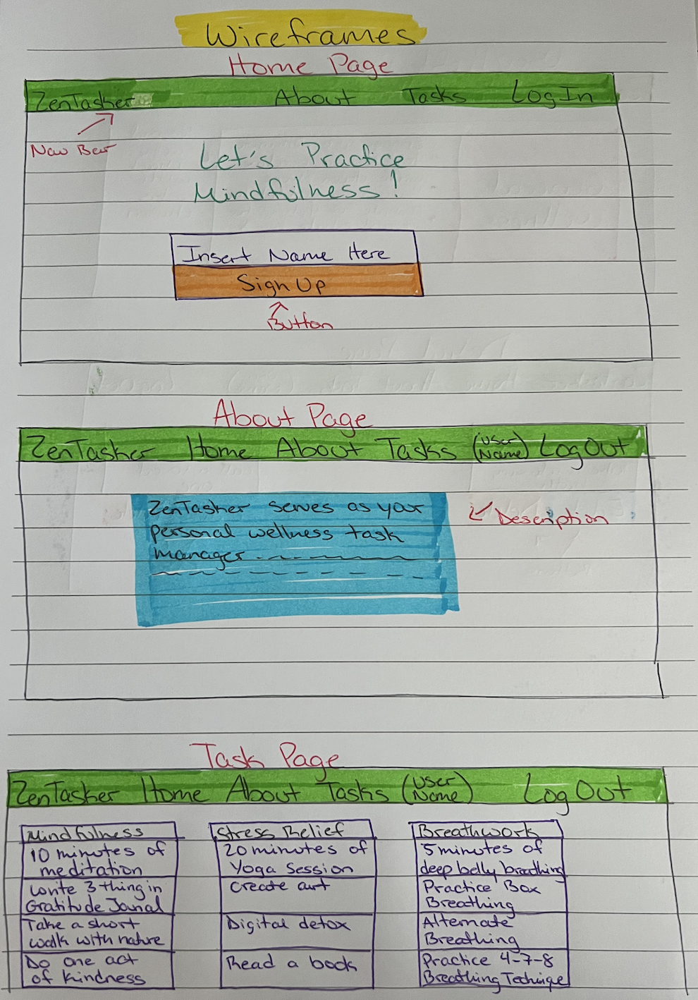
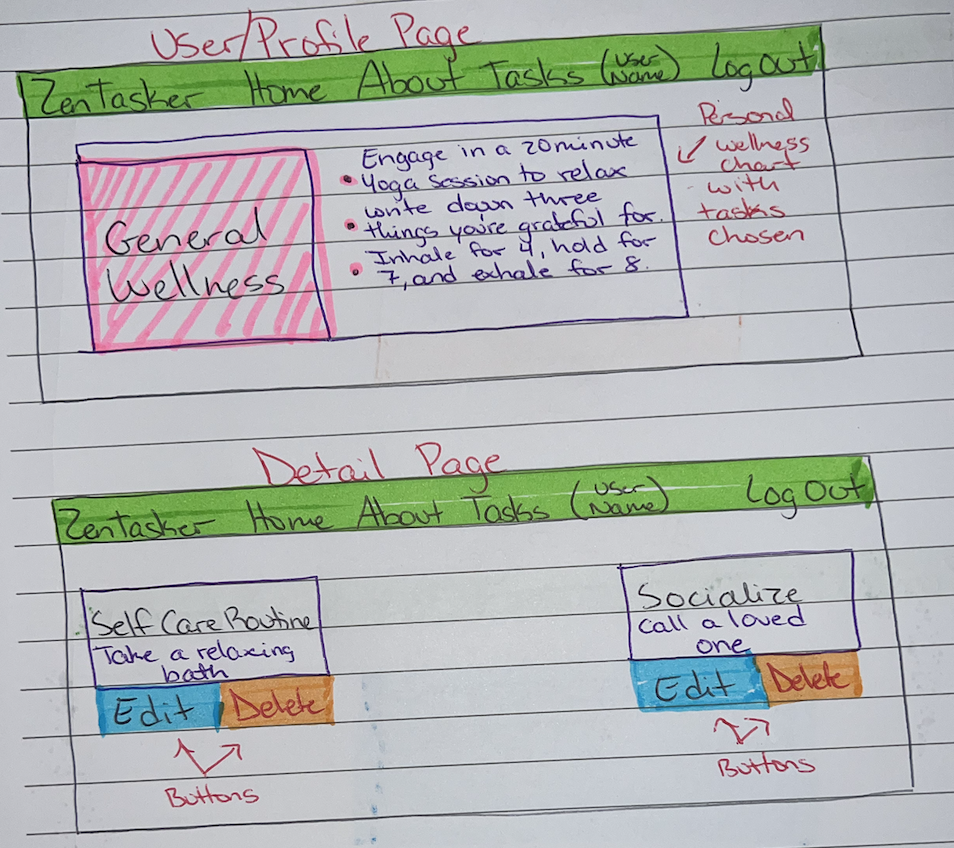
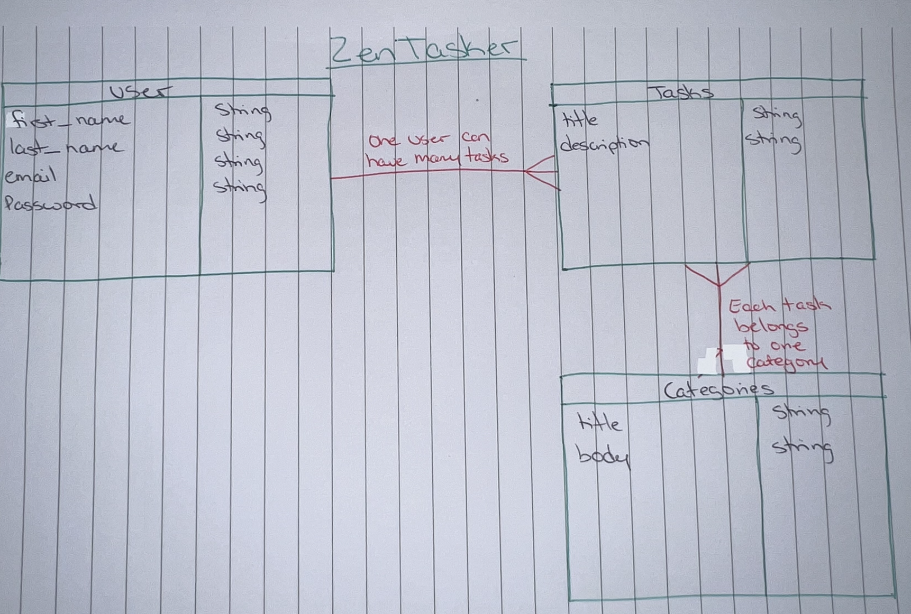

# ZenTasker

ZenTasker serves as your personal wellness task manager, seamlessly integrating mindfulness exercises, positivity trackers, and inspirational content into your daily to-do list. This application transcends the capabilities of a conventional to-do app by marrying mindfulness and productivity strategies to sharpen user focus and optimize task management. Its design seeks to inspire users to practice mindfulness, sustain concentration, and adeptly manage stress.

# Screenshot

# Technologies Used

- React
- Bootstrap
- CSS
- JavaScript
- Express
- Mongoose
- MongoDB

# User Stories

- As a user, I want to browse the Home Page, and feel a sense of zen by it's layout and user-friendly experience.
- As a user, I want to be able to navigate to the About Page, so I can see what the application is about.
- As a user, I want the option to register, so that I can start my mindfulness journey.
- As a user, I want the ability to log in, and log out so that I can have a personalized experience.
- As a user, I want the authorization to create my own zen task
- As a user, I want to edit my zen task in case I change my mind.
- As a user, I want to delete my zen task if I no longer feel the need to complete that specific one.
- As a user, I want to see a list of zen taks to add, in case there's an idea I have yet to try.
- As a user, I want the ability to see a list of all my tasks to help me keep organized.
- As a user, I want the ability to categorize my tasks so that I can manage my to-dos effectively.
- As a user, I want the reassurance of user authentication, so I know my entries are secured.

# Wireframes

# ERD

# Next Steps
